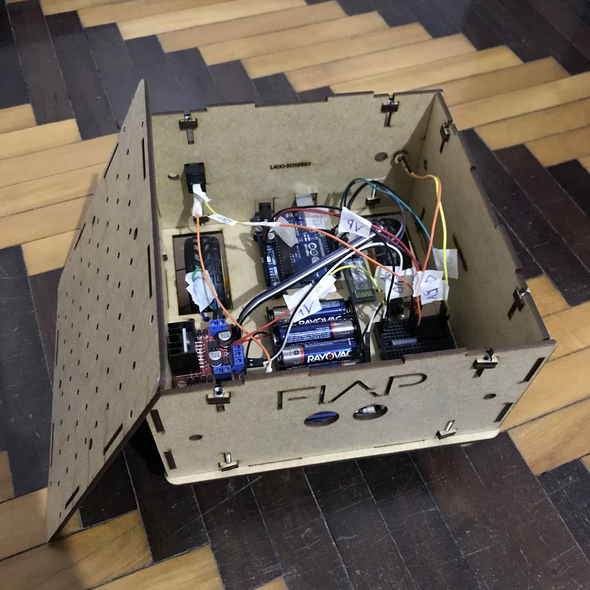
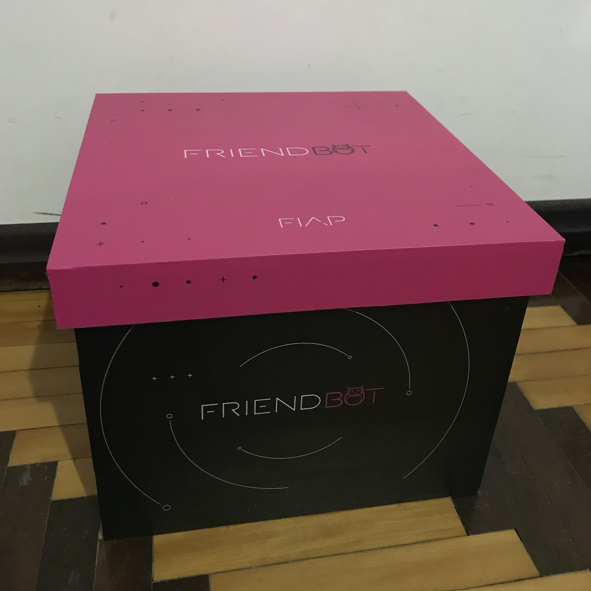

# FIAP FriendBot Code
Código do FriendBot para os exercícios. Para editar acesse o [link](http://ai2.appinventor.mit.edu/#5059818615603200).

## Merlin

## Merlin e eu

## Hardware

## Caixa do FriendBot

## Permissão de build negada no Linux
Rodar: `sudo chmod a+rw /dev/ttyACM0`.

## Se der erro no build
Necessário retirar módulo bluetooth.
